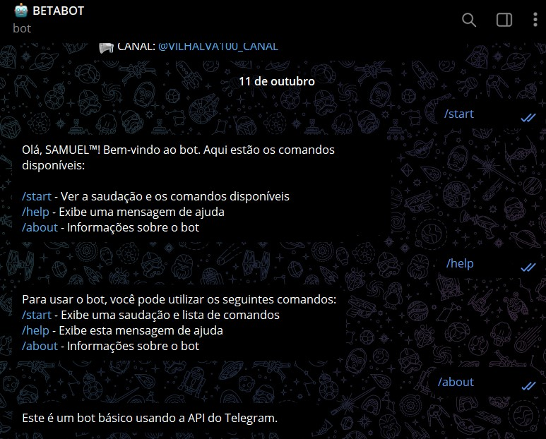

# TELEGRAM BOT EM RUST
🤤ESTE BOT FOI DESENVOLVIDO EM RUST UTILIZANDO A API DO TELEGRAM.

 <br>

## DESCRIÇÃO:
Este bot foi desenvolvido em RUST utilizando a API do Telegram. Ele responde a vários comandos que você pode enviar diretamente para ele em uma conversa privada. É um bot básico, mas personalizável, que pode ser expandido para incluir mais funcionalidades.

## FUNCIONALIDADES:
- **`/start`**: Inicia a conversa com o bot e envia uma mensagem de boas-vindas.
- **`/help`**: Exibe uma lista de comandos disponíveis que o usuário pode utilizar.
- **`/about`**: Fornece uma breve descrição do bot e seu propósito.

## EXECUTANDO O PROJETO:
1. **Configurar Token do Telegram**:
   - Abra o arquivo `./CODIGO/src/.env` e coloque sua credêncial:
     ```ruby
      BOT_TOKEN = 'SEU_TOKEN_AQUI'
     ```
   - Substitua `SEU_TOKEN_AQUI` pelo [token](https://t.me/BotFather) do seu bot do Telegram.

2. **Instale as dependências** 
   - Navegue até o diretório `./CODIGO` e digite o comando:
   ```bash
   cargo build
   ```

3. **Executar o Bot**:
   - Inicie o bot rodando o comando:
     ```bash
     cargo run
     ```
   - O bot estará pronto para interagir com você no Telegram!

4. **Interagindo com o Bot**:
   1. **Iniciar o Bot**:
      - No Telegram, inicie uma conversa com o bot enviando o comando `/start`. Isso fará com que o bot envie uma mensagem de boas-vindas.

   2. **Ver Lista de Comandos**:
      - Envie o comando `/help` para receber uma lista de comandos disponíveis e o que cada um faz.

   3. **Obter Informações sobre o Bot**:
      - Envie o comando `/about` para aprender mais sobre o bot e seu propósito.

## NÃO SABE?
- Entendemos que para manipular arquivos em muitas linguagens e tecnologias relacionadas, é necessário possuir conhecimento nessas áreas. Para auxiliar nesse aprendizado, oferecemos alguns subsidios:
* [VEJA A DOCUMENTAÇÃO](https://core.telegram.org/bots/api)
* [CURSO SUGERIDO](https://github.com/VILHALVA/CURSO-DE-TELEBOT)
* [CURSO DE RUST](https://github.com/VILHALVA/CURSO-DE-RUST)
* [CONFIRA MAIS CURSOS](https://github.com/VILHALVA?tab=repositories&q=+topic:CURSO)

## CREDITOS:
- [PROJETO CRIADO PELO VILHALVA](https://github.com/VILHALVA)

